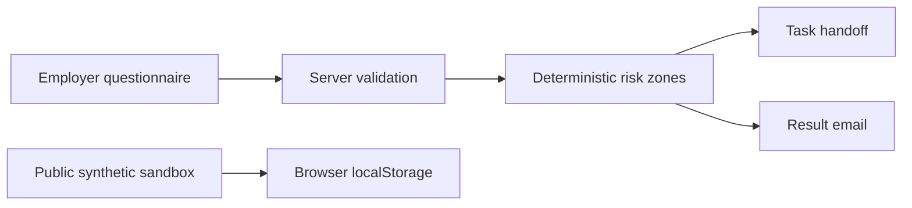

# KadrLine — technical overview

**Release state:** private HR risk-map implementation and [public synthetic handoff sandbox](../demos/kadrline/). [Case study](../cases/kadrline.html) · [sandbox screenshot](../assets/kadrline-workflow.png).

The commercial scoring and integration source is not in this repository. The sandbox source is public and can be previewed with `python3 -m http.server 4176` from this repository root.

## Workflow and architecture

The private Cloudflare Worker package exposes a bounded `POST /v1/assessments` contract. It validates and normalizes answers, scores on the server, then prepares WEEEK task and SMTP handoff. CORS is restricted to KadrLine HTTPS origins; the endpoint is intentionally public and CORS is not authentication. The source has request-size, content-type and consent checks.

The Worker uses persistent session markers plus a local cache/lock for **best-effort idempotency**. WEEEK does not provide an atomic unique key, so simultaneous requests in separate Worker instances could still duplicate a task. This limit matters when describing operational reliability.

The public sandbox is a separate static interface. It validates a fictional request, assigns a responsible role, records stages in localStorage and exports a JSON trail. It has no client data, scoring matrix, backend call, WEEEK action, SMTP action or legal conclusion.

## Verification and open gates

- Private Worker package: 20/20 automated tests passed in this audit.
- Public sandbox: browser-tested request → validation → assignment → result, reload persistence and export, including mobile visual review.
- GitHub Pages served the sandbox and its case page. The KadrLine Tilda page returned ddos-guard HTTP 402 to this environment, so production questionnaire submission and WEEEK/email delivery remain unverified here.

The next gate is authorized production readback with a redacted synthetic submission and delivery evidence. No employer/client data or private credentials should enter a public repository.

## AI-assisted delivery disclosure

The owner supplied the HR operations practice and portfolio direction. Codex audited the existing code, built the separate sandbox and tested it. Technical tests and a public sandbox are not proof of commercial outcome or legal correctness.
