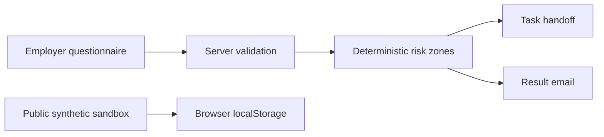

# KadrLine — technical overview

**Release state:** private HR risk-map implementation and [public synthetic handoff sandbox](../demos/kadrline/). [Case study](../cases/kadrline.html) · [sandbox screenshot](../assets/kadrline-workflow.png).

The commercial scoring and integration source is not in this repository. The sandbox source is public and can be previewed with `python3 -m http.server 4176` from this repository root.

## Workflow and architecture

The private Cloudflare Worker package exposes a bounded `POST /v1/assessments` contract. It validates and normalizes answers, scores on the server, then prepares WEEEK task and SMTP handoff. CORS is restricted to KadrLine HTTPS origins; the endpoint is intentionally public and CORS is not authentication. The source has request-size, content-type and consent checks.

The Worker uses persistent session markers plus a local cache/lock for **best-effort idempotency**. WEEEK does not provide an atomic unique key, so simultaneous requests in separate Worker instances could still duplicate a task. This limit matters when describing operational reliability.

The public sandbox is a separate static interface. It validates a fictional request, assigns a responsible role, records stages in localStorage and exports a JSON trail. It has no client data, scoring matrix, backend call, WEEEK action, SMTP action or legal conclusion.

## Verification and open gates

- Private Worker package: 25/25 automated tests passed for Sites version 13, deployed from source commit `165c3c54e3158dad6a4a263c221587f6a257b440`. The added tests drive fictional requests through mocked WEEEK and SMTP adapters, including a replay and an SMTP failure. They verify local integration behavior, not live delivery. Earlier versions remain available for rollback.
- Public sandbox: browser-tested request → validation → assignment → result, reload persistence and export, including mobile visual review.
- GitHub Pages served the sandbox and its case page. A read-only live API health request returned HTTP 200 with SMTP and WEEEK configuration flags true; an allowed-origin `OPTIONS` preflight returned 204. These checks establish endpoint availability and configuration, not task or email delivery.
- The existing public [eight-question military-accounting checklist](https://kadrline-risk-map-api.isepifanov.chatgpt.site/voinskiy-uchet) was opened on 2 October 2026. Fictional answers reached a generated result; the 390 px result had no horizontal overflow. The contact form was not submitted, and legal or price copy was not revalidated in this portfolio review. Analytics requests initially hit CSP errors. Version 11 added only the specific Yandex Metrica WebSocket, image and frame origins used by the page; fresh browser loads of the checklist and calculator showed zero console errors. This is functional UI evidence, not lead-delivery or legal-accuracy evidence.
- Sites version 13 also supplied a branded SVG favicon and a redirect from `/favicon.ico`, resolving the 404s seen in read-only Worker logs. Live readback returned 200 for SVG, 302 for the legacy icon path and 200 for both HTML pages.
- Sites version 12 changed both contact forms to distinguish an SMTP-accepted message from an existing request whose email status cannot be confirmed. Browser checks used fictional responses with no network POST and verified both messages on the checklist and the uncertain state on the calculator. The deployed HTML was read back with HTTP 200 for both pages. This prevents the interface from promising an email on an idempotent replay; it does not resend a failed email.
- The KadrLine Tilda page returned ddos-guard HTTP 402 to this environment, so the public questionnaire user flow and production POST submission remain unverified here.

The next gate is authorized production readback with a redacted synthetic submission and delivery evidence. No employer/client data or private credentials should enter a public repository.

## AI-assisted delivery disclosure

The owner supplied the HR operations practice and portfolio direction. Codex audited the existing code, built the separate sandbox and tested it. Technical tests and a public sandbox are not proof of commercial outcome or legal correctness.
