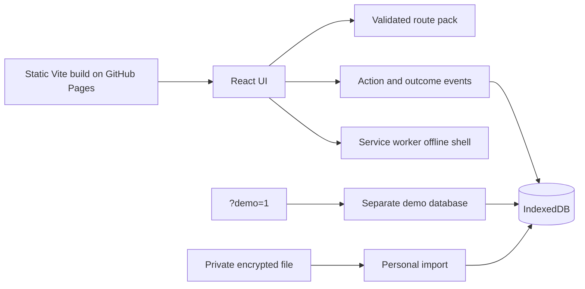

# LIFE: REBUILD v3 — technical overview

**Release state:** public phone beta with a synthetic reviewer route. [Open demo](https://ejonnyss.github.io/life-rebuild/v3-phone-test/?demo=1) · [case study](../cases/life.html) · [synthetic screenshot](../assets/life-demo-mobile.png).

The current v3 source branch is local. This public overview does not represent the public `life-rebuild` main branch as the v3 code. The production build is published on GitHub Pages; private route packs and personal media are outside the public repository.

## Product boundary

The app is life navigation with one main route and limited alternatives. A completed action and an external outcome are different events. Demo actions and outcomes are explicitly fictional; neither is counted as the owner's real progress.

## Architecture



- React 19, TypeScript and Vite produce static assets. The browser owns the event log and media storage; there is no account server or central personal database.
- The `?demo=1` selector chooses `life-rebuild-demo-v1` before state or media reads. The personal route uses `life-rebuild-v3` and continues to require an encrypted import.
- Route packs are validated and checksummed. A simulated action advances the fictional mission, while a separate external-result event changes the world state.
- The personal path has encrypted backup/import. The source uses PBKDF2-SHA256 key derivation and AES-GCM for that file; the demo does not handle personal files.
- A service worker precaches the static shell and illustrations. The 16 MP4 files load as needed, or the user can save all of them from “Герой” for offline viewing. Physical-iPhone offline acceptance remains open.

## Setup and verification

The local source checkout (not distributed in this portfolio repository) uses:

```sh
npm ci
npm test
npm run lint
npm run build
```

After the demo and offline-shell changes, 39/39 tests, lint and build passed. Browser QA checked a new demo session, action → separate external result, reload persistence and mode isolation at 390 px and 1280 px. A fresh local install activated the service worker in 214 ms with 19 cached shell files and no MP4 files; the optional save control cached all 16 videos and an offline reload succeeded. GitHub Pages build `5aec023` served the updated bundle; a fresh live browser found the same 19 shell files and reloaded the demo offline at 390 px without horizontal overflow. Local timing is not a live performance measurement. These checks do not establish retention, long-term usefulness or iPhone acceptance.

## Decisions and next gates

The reviewer access problem was solved with a synthetic route rather than a remote account or private file in the public bundle. The next gates are physical-device QA, owner review of the personal route and evidence of meaningful life outcomes over time. Notifications and AI APIs should be considered only if they help a tested user need.

## AI-assisted delivery disclosure

The owner defined the life-navigation model and approved a safe portfolio demonstration. Codex implemented the isolated demo, regression check and browser QA under those requirements. Final product acceptance by the owner is still open.
